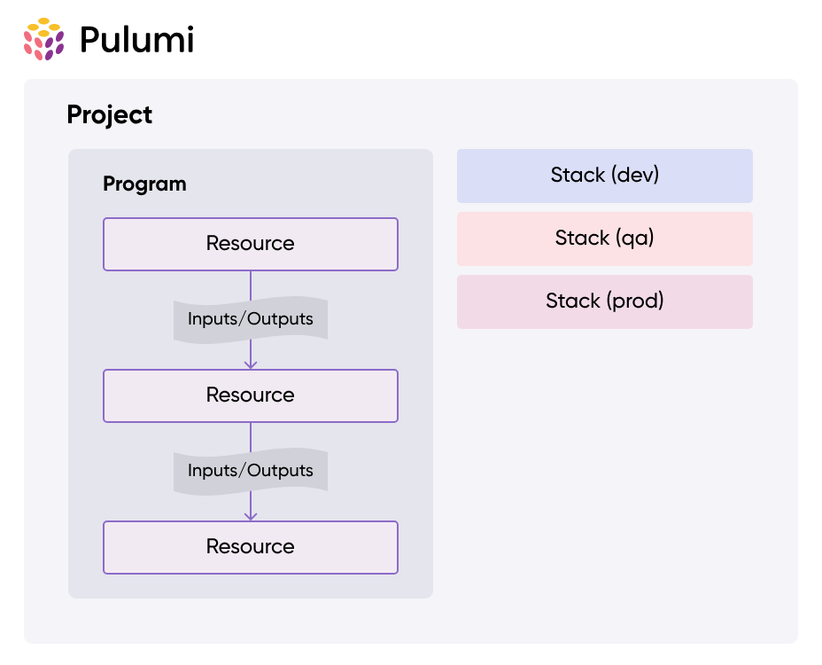
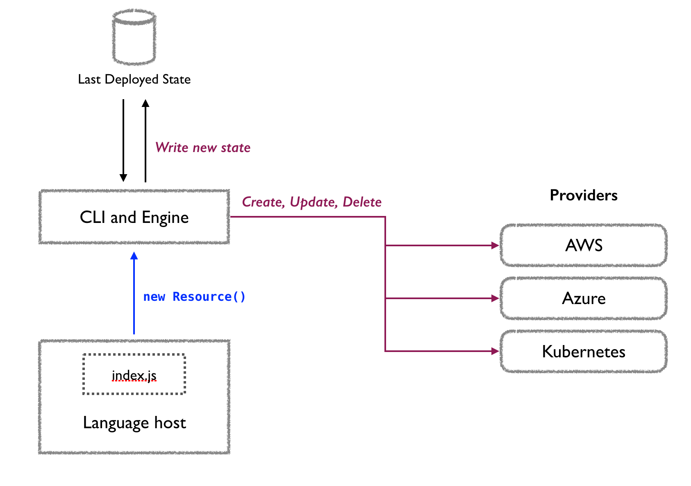
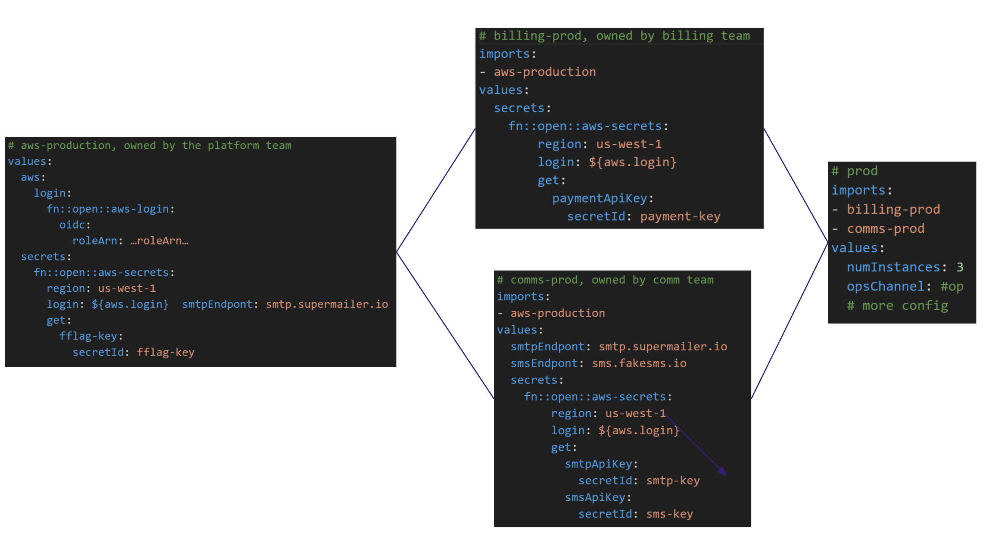

### 1. What is Pulumi?
- IaC tool
- Favorite programming language

### 2. Supported language
- TypeScript & JavaScript (Node.js)
- Python
- Go
- C#, VB, F# (.NET)
- Java
- Pulumi YAML

### 3. Structure


### 4. Interaction


### 5. Concept
- Projects
    A Pulumi project is any folder that contains a Pulumi.yaml project file. At runtime, the nearest parent folder containing a Pulumi.yaml file determines the current project. Projects are created with the pulumi new command.
  
- Stacks
    Every Pulumi program is deployed to a stack. A stack is an isolated, independently configurable instance of a Pulumi program. Stacks are commonly used to denote different phases of development (such as development, staging, and production) or feature branches (such as feature-x-dev).

    ```
    pulumi stack init staging
    ```

- Resources
    Resources represent the fundamental units that make up your cloud infrastructure, such as a compute instance, a storage bucket, or a Kubernetes cluster.

- Inputs & outputs
    ```
    myId, err := random.NewRandomId(ctx, "mine", &random.RandomIdArgs{
        ByteLength: pulumi.Int(8), // ByteLength is an input
    })
    if err != nil {
        return err
    }
    ```

- Configuration
    The key-value pairs for any given stack are stored in your project’s stack settings file, which is automatically named Pulumi.<stack-name>.yaml.
    ```
    package main

    import (
        "github.com/pulumi/pulumi/sdk/v3/go/pulumi"
        "github.com/pulumi/pulumi/sdk/v3/go/pulumi/config"
    )
    func main() {
        pulumi.Run(func(ctx *pulumi.Context) error {
            conf := config.New(ctx, "")
            name := conf.Require("name")
            lucky, err := conf.TryInt("lucky")
            if err != nil {
                lucky = 42
            }
            secret := conf.RequireSecret("secret")
            return nil
        }
    }
    ```

- Pulumi supports encrypting individual values as secrets for additional protection. Encryption ensures that these values never appear as plain text in your state file

```
pulumi config set --secret dbPassword S3cr37
pulumi config
KEY                        VALUE
dbPassword                 [secret]
```

- Environments


- State
    Pulumi supports two classes of state backends for storing your infrastructure state:

    - Pulumi Cloud: a managed cloud experience using the online or self-hosted Pulumi Cloud application
    - Self-Managed: a manually managed object store, including AWS S3, Azure Blob Storage, Google Cloud Storage, any AWS S3 compatible server such as Minio or Ceph, or your local filesystem

    More: https://www.pulumi.com/docs/concepts/state/
    